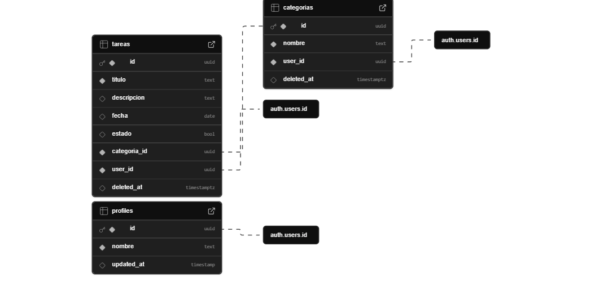

# To-Do List App

## **Tecnologías Utilizadas**

### 1. **Frontend**
- **React**: Framework principal para la interfaz de usuario.
- **TypeScript**: Añade tipado estático para mayor seguridad y mantenibilidad.
- **Tailwind CSS**: Framework de estilos utilitario para diseño responsivo y rápido.
- **React Router DOM**: Para navegación entre páginas (`/dashboard`, `/category/:id`, etc.).
- **Supabase JS Client**: Para conectar directamente con Supabase Auth y Base de Datos.
- **Vitest + Testing Library**: Para pruebas unitarias y de integración.
- **React Hooks**: Para gestión de estado (`useEffect`, `useState`, `useNavigate`, `useAuth`).

### 2. **Backend y Base de Datos**
- **Supabase Auth**: Para autenticación de usuarios y gestión de sesión.
- **Supabase DB (PostgreSQL)**: Almacena tareas, categorías y perfiles de usuarios.
- **Row Level Security (RLS)**: Garantiza que cada usuario solo vea sus datos.

## **Patrón de Diseño Aplicado**
- **Patrón Singleton**: Implementado para garantizar una **única instancia de conexión con Supabase** en toda la aplicación.  
- **Ventajas**:  
  - **Conexión única**: Evita múltiples instancias de `supabaseClient`, mejorando eficiencia y coherencia.  
  - **Centralización**: La lógica de conexión está encapsulada en un único punto.  
  - **Facilita testing**: Permite mockear fácilmente en pruebas unitarias.  
- **Ejemplo**: `src/utils/supabaseClient.ts` (clase `SupabaseSingleton` con `getInstance()`).

### ¿Por qué se usó?
Para garantizar que exista **una única instancia** de conexión con Supabase durante toda la aplicación, evitando múltiples conexiones innecesarias y asegurando coherencia en las llamadas a la base de datos.

#### Ejemplo en `src/utils/supabaseClient.ts`

### Ventajas:
- **Conexión única**: Evita múltiples instancias de `supabaseClient`.
- **Centralización**: Toda la lógica de conexión está en un solo lugar.
- **Facilita el testing**: Se puede mockear fácilmente en pruebas unitarias.
- **Mejora rendimiento**: Reutiliza la misma conexión sin crear una nueva cada vez.

### **¿Qué problema resuelve la aplicación del patrón Singleton?**

El uso del **patrón Singleton** resuelve el problema de **gestionar múltiples instancias de conexión con Supabase**, lo que puede causar:
- Inconsistencias en la sesión y autenticación.
- Sobrecarga innecesaria al crear múltiples clientes.
- Dificultad para mantener un estado global coherente.

Al aplicar este patrón, se asegura que **siempre se use la misma instancia del cliente `supabase`**, garantizando una conexión estable, segura y eficiente a través de toda la aplicación. Esto mejora el rendimiento, evita errores por múltiples inicializaciones y facilita las pruebas unitarias al centralizar la lógica de conexión.

### **Beneficios del Patrón Singleton**

| Beneficio | Descripción |
|----------|-------------|
| **Conexión única** | Garantiza que solo exista una instancia de `supabaseClient` en toda la aplicación |
| **Centralización** | La lógica de conexión y autenticación está encapsulada en un único punto |
| **Eficiencia** | Evita crear múltiples conexiones innecesarias a Supabase |
| **Consistencia** | Asegura que todas las partes del proyecto usen el mismo cliente de Supabase |
| **Facilidad para testing** | Se puede mockear fácilmente en pruebas unitarias |
| **Mantenibilidad** | Si cambia la forma de conectar con Supabase, solo se modifica en un lugar |

---

## **Cómo Ejecutar el Proyecto**

### 1. **Clonar el repositorio**
```bash
git clone https://github.com/evertms/toDo-list-app.git
cd toDo-list-app
```

### 2. **Instalar dependencias**
```bash
npm install
```

### 3. **Configurar variables de entorno**
Copia el archivo `.env.example` como `.env`:

```bash
cp .env.example .env
```

Edita `.env` con tus credenciales de Supabase:

> Estas credenciales las obtienes desde tu proyecto en [https://supabase.com/dashboard/project/{id}](https://supabase.com/dashboard/organizations) → Connect → App Frameworks → Framework: React using Vite.

### 4. **Ejecutar el proyecto**
Ejecutar el siguiente comando en la terminal: 
```bash  
npm run dev
```
---

## **Cómo Ejecutar las Pruebas Unitarias**

```bash
npm run test
```

### Modo observador (ideal durante desarrollo)
```bash
npm run test -- --watch
```

### Generar reporte de cobertura
```bash
npm run test -- --coverage
```

---

## **Configuración en Supabase**

### Esquema de base de datos


### 1. **Crear tablas**

#### Tabla `profiles`
```sql
CREATE TABLE public.profiles (
  id uuid PRIMARY KEY REFERENCES auth.users(id) ON DELETE CASCADE,
  nombre text NOT NULL,
  updated_at timestamp DEFAULT now()
);
```

#### Tabla `categorias`
```sql
CREATE TABLE public.categorias (
  id uuid PRIMARY KEY DEFAULT gen_random_uuid(),
  nombre text NOT NULL,
  user_id uuid REFERENCES auth.users(id) NOT NULL,
  created_at timestamp DEFAULT now(),
  updated_at timestamp DEFAULT now()
);
```

#### Tabla `tareas`
```sql
CREATE TABLE public.tareas (
  id uuid PRIMARY KEY DEFAULT gen_random_uuid(),
  titulo text NOT NULL,
  descripcion text,
  fecha date NOT NULL,
  estado boolean DEFAULT false,
  categoria_id uuid REFERENCES public.categorias(id),
  user_id uuid REFERENCES auth.users(id) NOT NULL,
  deleted_at timestamp DEFAULT NULL
);
```

---

### 2. **Políticas de seguridad (RLS) para Supabase**

#### Para `profiles`
```sql
-- Ver perfil propio
CREATE POLICY "Usuarios ven su perfil" ON public.profiles
FOR SELECT USING (auth.uid() = id);

-- Actualizar perfil
CREATE POLICY "Usuarios pueden actualizar su perfil" ON public.profiles
FOR UPDATE USING (auth.uid() = id);

-- Crear perfil
CREATE POLICY "Usuarios pueden crear su perfil" ON public.profiles
FOR INSERT USING (auth.uid() = id);
```

#### Para `categorias`
```sql
-- Solo el usuario puede ver sus categorías
CREATE POLICY "Usuarios ven sus categorías" ON public.categorias
FOR SELECT USING (user_id = auth.uid());

-- Solo el usuario puede crear categorías
CREATE POLICY "Usuarios pueden crear categorías" ON public.categorias
FOR INSERT WITH CHECK (user_id = auth.uid());

-- Actualizar categorías
CREATE POLICY "Usuarios pueden actualizar sus categorías" ON public.categorias
FOR UPDATE USING (user_id = auth.uid());
```

#### Para `tareas`
```sql
-- Solo el usuario puede ver sus tareas
CREATE POLICY "Usuarios ven sus tareas" ON public.tareas
FOR SELECT USING (user_id = auth.uid());

-- Solo el usuario puede crear tareas
CREATE POLICY "Usuarios pueden crear tareas" ON public.tareas
FOR INSERT WITH CHECK (user_id = auth.uid());

-- Actualizar tareas
CREATE POLICY "Usuarios pueden editar sus tareas" ON public.tareas
FOR UPDATE USING (user_id = auth.uid());

-- Borrado lógico
ALTER TABLE public.tareas ENABLE ROW LEVEL SECURITY;

-- Cada usuario puede ver solo sus tareas
CREATE POLICY "Usuarios ven sus tareas" ON public.tareas
FOR SELECT USING (user_id = auth.uid());
```

---

## **Estructura del Proyecto**

```
src/
├── components/            # Componentes reutilizables
├── hooks/                 # Custom hooks
├── models/                # Interfaces de datos
├── pages/                 # Páginas de la aplicación
├── services/              # Servicios que conectan con Supabase
├── utils/                 # supabaseClient.ts
├── tests/                 # Pruebas unitarias 
└── App.tsx                # Enrutamiento general de la app
```

---

## **Historias de Usuario Implementadas**

1. **Como usuario, quiero registrarme para empezar a gestionar mis tareas.**
   - Registro con email, contraseña y nombre.
   - Crea automáticamente un perfil y categoría por defecto (`General`).

2. **Como usuario, quiero crear, editar, eliminar o completar tareas**
   - Crear, editar, marcar como completada o eliminar tareas.
   - Marcar como no completada en el otro caso.

3. **Como usuario, quiero ver mis categorías y las tareas que tengo en ellas**
   - Listar categorías personalizadas.
   - Mostrar tareas creadas por el usuario en las categorías personalizadas.

---

## **Lecciones Aprendidas**

| Lección | Descripción |
|--------|-------------|
| **TypeScript** | Ayudó a detectar errores de tipado más tempranamente |
| **Supabase Auth** | Es fácil de integrar y seguro para autenticación, manda correos de verificación y encripta las contraseñas |
| **Pruebas unitarias** | Son esenciales para validar lógica e incluso UI y evitar regresiones |
| **Testing Library** | Facilita la simulación de interacciones y UI |
| **Row Level Security** | Es clave para mantener datos privados por usuario |

---

## **Funcionalidades Principales**

| Funcionalidad | Descripción |
|---------------|-------------|
| Registro y Login | Con email y contraseña, usando Supabase Auth |
| Perfil de usuario | Nombre y correo dinámicos desde Supabase |
| CRUD de tareas | Crear, listar, editar y eliminar tareas |
| Categorías | Filtrar tareas por categoría |
| Borrado lógico | No borrar datos reales, solo marcar como eliminado |
| Sidebar dinámico | Muestra categorías y actualiza tras crear/editar |
| Modal de creación de categorías | Sin recargar página |

---

## **Instrucciones de Uso**

1. **Registro de usuario**
   - Ingresar email, contraseña y nombre
   - Se crea automáticamente el perfil y categoría por defecto

2. **Login**
   - Acceder a tu cuenta y ver tus tareas

3. **Dashboard**
   - Listar todas las tareas
   - Marcar como completada/incompleta
   - Eliminar tarea
   - Editar tarea

4. **Categorías**
   - Crear, editar o eliminar categorías
   - Solo se muestran las del usuario actual

5. **Crear nueva tarea**
   - Formulario con título, descripción, fecha y categoría
   - Valida que la descripción no exceda 500 caracteres

---

## **¿Qué mejorarías si tuvieras una semana más?**

- **Manejo de errores más avanzado** (ej: redirección tras 3 intentos fallidos)
- **Notificaciones** y recordatorios para tareas con fechas próximas
- **Mejorar UI/UX** con animaciones y modo oscuro
- **Flujo de registro** con más información del usuario

---

## **Contribuir al Proyecto**

Si deseas contribuir, abre un pull request o informa un issue.
